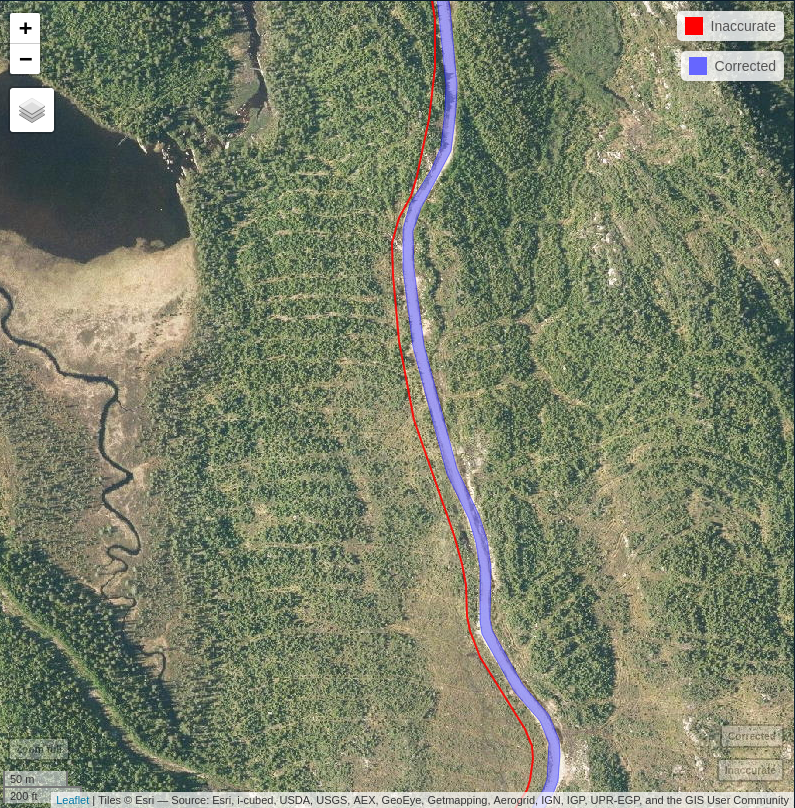

# ALSroads

ALSroads provides tools to relocate, measure and estimate the state of forestry roads from an inaccurate map. This project has been made in partnership with the [Ministère des Forêts, de la Faune et des Parcs du Québec (MFFP)](https://mffp.gouv.qc.ca/). It contains the implementation of the algorithm described in:

> Jean-Romain Roussel, Jean-François Bourdon , Ilythia D. Morley , Nicholas C. Coops, Alexis Achim (2022). Correction, update, and enhancement of vectorial forestry road maps using ALS data, a pathfinder, and seven metrics. International Journal of Applied Earth Observation and Geoinformation


## Installation

``` r
remotes::install_github("Jean-Romain/ALSroads")
```

## Example

In the following example we can see a road from reference forestry road maps in red. This road is inaccurately mapped and records neither its class nor its width. The algorithm recomputes the accurate location of the road for a lidar point cloud and estimates its width and its state. Here we have an class 1 road with a width of 8 meters.

```r
library(ALSroads)
library(lidR)
library(sf)
library(raster)
library(mapview)
library(leaflet)

# Load data (LAS tiles, DTM, map)
dir  <- system.file("extdata", "", package="ALSroads")
road <- system.file("extdata", "road_971487.gpkg", package="ALSroads")
dtm  <- system.file("extdata", "dtm_1m.tif", package="ALSroads")
ctg  <- readLAScatalog(dir)
road <- st_read(road, quiet = TRUE)
dtm  <- raster(dtm)
crs(dtm) <- crs(road)

# Relocate the road at the correct location
# Measure the width and estimate its state (operating/decommisionned)
res <- measure_road(ctg, road, dtm)
poly <- sf::st_buffer(res, res$ROADWIDTH/2)

# Display results
url = "https://servicesmatriciels.mern.gouv.qc.ca:443/erdas-iws/ogc/wmts/Inventaire_Ecoforestier/Inventaire_Ecoforestier/default/GoogleMapsCompatibleExt2:epsg:3857/{z}/{y}/{x}.jpg"
m = mapview::mapview(list(road, poly),
  layer.name = c("Inaccurate", "Corrected"),
  color = c("red", "blue"), map.type = "Esri.WorldImagery")
leaflet::addTiles(m@map, url)
```



